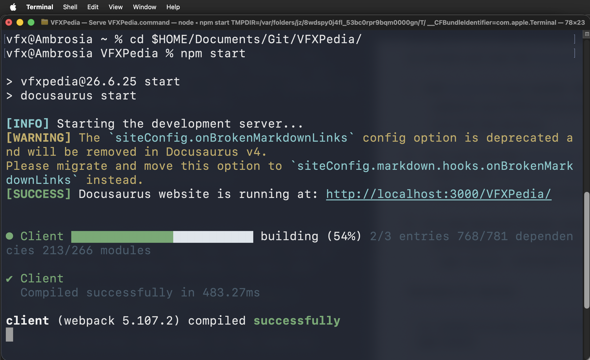
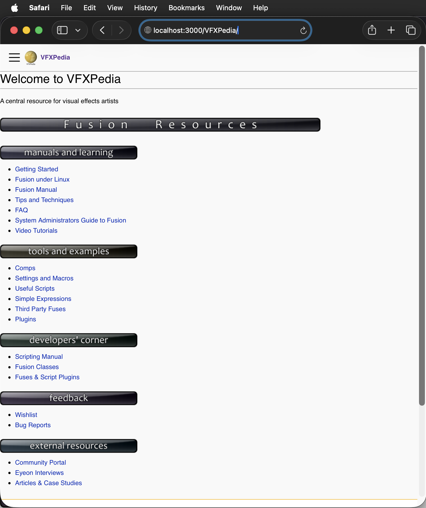

# VFXPedia


## Overview

After a short 12 year break, the VFXPedia learning resource is back on the web!

## Editing the Wiki

During the VFXPedia development stage, you need to install [NodeJS](https://nodejs.org/en) to compile and view the [Docusaurus](https://docusaurus.io/docs/installation) formatted markdown content.

Add [NodeJS](https://nodejs.org/en) to your system. Make sure you have the "npm" utility added to your PATH environment variable so you can run this CLI tool from the terminal.

Use a git client like [GitKraken](https://www.gitkraken.com/download) or [GitHub Desktop](https://desktop.github.com/download/) to download a local copy of the VFXPedia git repo:  

[https://github.com/Kartaverse/VFXPedia/](https://github.com/Kartaverse/VFXPedia/)

> Note: The VFXPedia repo is set to a private visibility state during the development stage.

In a new terminal window, navigate to the location where you downloaded the VFXPedia git repo content. Then run the `npm start` command to launch the local staging server. Example CLI Syntax:

```bash
cd $HOME/Documents/Git/VFXPedia/
npm start
```



If the NodeJS server activates without issue, you should be able to view the content live at the following localhost address in your default web-browser:

[http://localhost:3000/VFXPedia/](http://localhost:3000/VFXPedia/)   

This is what the VFXPedia website should look like:




